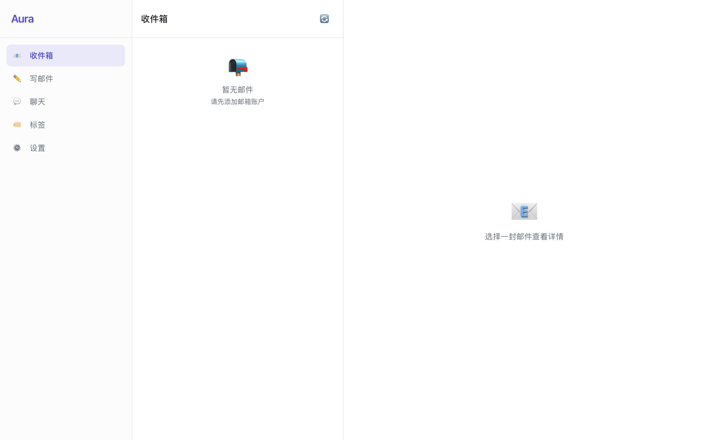
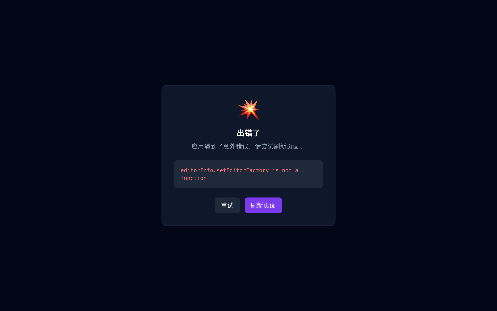
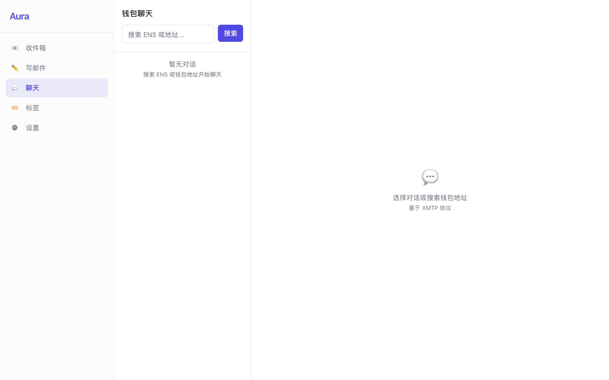
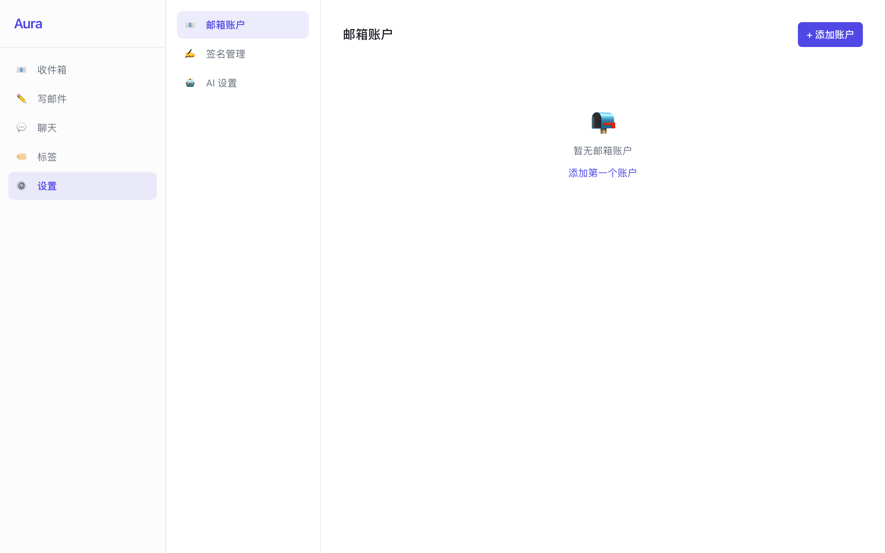

<div align="center">

# Aura
> Decentralized AI Email Client · 去中心化 AI 邮箱客户端



### Wallet-Based Sign-In · Multi-Email Management · AI-Powered Assistant

[](https://github.com/frankfika/dismaill/releases)
[](https://github.com/frankfika/dismaill)
[](LICENSE)

[Features](#-features) • [Screenshots](#-screenshots) • [Quick Start](#-quick-start) • [Download](#-download) • [Architecture](#-architecture)

[简体中文](./README.md) | __English__

---
</div>

## Introduction

Aura is the **first wallet-anchored** AI-native email client, featuring:

- **Wallet Sign-In** — Use wallet signatures instead of passwords, restore all configs with one click
- **Multi-Email Management** — Support Gmail, Outlook, iCloud, and custom SMTP/IMAP
- **AI-Assisted Writing** — Preset agents + prompt templates + conversational optimization
- **Offline-First Architecture** — Local-First, core features work without internet
- **ENS Domain Resolution** — Discover contacts via ENS domain names
- **XMTP Wallet Chat** — End-to-end encrypted messaging via wallet addresses

### Why Aura?

| Traditional Email | Aura |
|-----------------|------|
| Passwords are vulnerable | Wallet signatures, phishing-proof |
| Multiple accounts are hard to manage | Wallet identity anchor, one-click switching |
| Manual email organization | AI auto-classification and tagging |
| Centralized services | Decentralized identity, data ownership |

## Features

### 1. Wallet Identity Sign-In

- MetaMask and WalletConnect support
- Wallet signature verification, no passwords needed
- ENS domain automatic resolution and display
- One-click restore all email configurations


### 2. Unified Multi-Email Management

- Gmail / Outlook / iCloud / Custom SMTP/IMAP
- Unified inbox aggregation view
- Email account grouping
- Offline email queue, compose even without connection


### 3. Markdown Email Editor

- Milkdown WYSIWYG editor
- Native code highlighting, tables, and lists
- Signature template management
- Image paste and drag-and-drop support



### 4. AI Smart Assistant

- AI-assisted email writing and refinement
- Smart tag auto-classification
- Smart folder aggregation
- Support for Anthropic / OpenAI providers

### 5. Web3 Social Features

- ENS domain contact discovery
- XMTP wallet end-to-end encrypted chat
- Decentralized identity system



## Screenshots

| Login | Inbox | Compose |
|:------:|:------:|:--------:|
|  |  |  |

| Settings | Chat |
|:------:|:---:|
|  |  |

## Quick Start

### Requirements

| Tool | Version |
|------|---------|
| Node.js | >= 20 LTS |
| pnpm | >= 9.x |
| Python | >= 3.10 |

### Run from Source

```bash
# Clone project
git clone https://github.com/frankfika/dismaill.git
cd dismail

# Install dependencies
pnpm install

# Start development server
pnpm dev
```

### Environment Variables

```bash
cp .env.example .env.local
```

Edit `.env.local`:

```bash
# AI Provider
VITE_DEFAULT_AI_PROVIDER=openai

# XMTP Environment
VITE_XMTP_ENV=production

# Ethereum RPC
VITE_INFURA_PROJECT_ID=your-infura-project-id
```

## Download

### macOS

- Apple Silicon: [Aura_1.0.0_aarch64.dmg](https://github.com/frankfika/dismaill/releases/latest/download/Aura_1.0.0_aarch64.dmg)
- Intel: [Aura_1.0.0_x64.dmg](https://github.com/frankfika/dismaill/releases/latest/download/Aura_1.0.0_x64.dmg)

### Windows

- Installer: [Aura_1.0.0_x64-setup.exe](https://github.com/frankfika/dismaill/releases/latest/download/Aura_1.0.0_x64-setup.exe)
- MSI: [Aura_1.0.0_x64_en-US.msi](https://github.com/frankfika/dismaill/releases/latest/download/Aura_1.0.0_x64_en-US.msi)

### Linux

- Debian/Ubuntu: [Aura_1.0.0_amd64.deb](https://github.com/frankfika/dismaill/releases/latest/download/Aura_1.0.0_amd64.deb)
- Fedora/RHEL: [Aura-1.0.0-1.x86_64.rpm](https://github.com/frankfika/dismaill/releases/latest/download/Aura-1.0.0-1.x86_64.rpm)
- AppImage: [Aura_1.0.0_amd64.AppImage](https://github.com/frankfika/dismaill/releases/latest/download/Aura_1.0.0_amd64.AppImage)

View all releases: [Release Page](https://github.com/frankfika/dismaill/releases)

## Architecture

### Tech Stack

| Category | Technology |
|----------|------------|
| Desktop Framework | Tauri v2 |
| Frontend | React 18 + TypeScript |
| UI | Shadcn/UI + TailwindCSS |
| State Management | Zustand |
| Data Fetching | TanStack Query |
| Wallet Integration | Wagmi v2 + Viem v2 + RainbowKit |
| Email Sending | Nodemailer + Imapflow |
| Local Database | better-sqlite3 |
| Markdown | Milkdown |
| AI SDK | Vercel AI SDK |
| Chat Protocol | @xmtp/xmtp-js |

### Project Structure

```
src/
├── main/                    # Tauri main process
│   ├── index.ts             # Main entry
│   ├── ipc/                 # IPC Handlers
│   ├── services/            # Business logic
│   └── database/            # SQLite database
│
├── renderer/                # React renderer process
│   ├── src/
│   │   ├── routes/          # Page routes
│   │   ├── components/       # UI components
│   │   ├── stores/          # Zustand stores
│   │   └── lib/             # Utilities
│   └── index.html
│
└── shared/                  # Shared types and constants
```

### IPC Communication

All IPC calls use a unified response format:

```typescript
interface IpcResponse<T> {
  success: boolean;
  data?: T;
  error?: {
    code: string;
    message: string;
  };
}
```

## Roadmap

| Version | Features |
|---------|----------|
| v1.0 | Wallet sign-in, email send/receive, signature management, offline support |
| v1.5 | AI-assisted writing, smart tags, smart folders |
| v2.0 | ENS chat, wallet chat, enterprise features, plugin ecosystem |

## Testing

```bash
# Unit tests
pnpm test

# Type check
pnpm typecheck

# ESLint
pnpm lint

# E2E tests
pnpm test:e2e

# Run all tests
pnpm test:all
```

## CI/CD

GitHub Actions for continuous integration:

- **Push** to main/develop branches triggers auto-run
- **PR** auto-runs lint + typecheck + unit tests
- **Release** auto-builds for all platforms

## Contributing

1. Fork the project
2. Create feature branch (`git checkout -b feature/amazing-feature`)
3. Commit changes (`git commit -m 'Add amazing feature'`)
4. Push to branch (`git push origin feature/amazing-feature`)
5. Create Pull Request

## License

MIT License

## Contact

- GitHub Issues: https://github.com/frankfika/dismaill/issues
- Website: https://aura.email (coming soon)