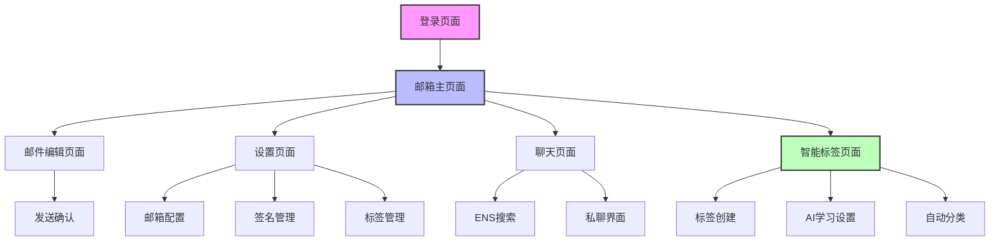

# Aura — 去中心化 AI 邮箱客户端 · 产品需求文档

## 1. 产品愿景与定位

### 1.1 愿景声明

> 在 Web3 时代，你的身份、数据和通信不应被任何中心化服务绑架。Aura 是第一款以**钱包为身份锚点**的 AI 原生邮箱客户端——用一次钱包签名取代无尽的密码重置，用 AI 消灭重复劳动，用 ENS 打通链上社交。无论你换设备、换系统，所有邮箱配置一键恢复，所有聊天记录端到端加密。Aura 不只是一个更好的邮箱，它是 Web3 原住民的通信操作系统。

### 1.2 核心价值主张

| # | 差异化卖点 | 一句话说明 |
|---|-----------|-----------|
| 1 | **钱包登录，一键恢复** | 告别密码管理地狱——钱包签名即身份，换设备零迁移成本 |
| 2 | **AI 原生** | 内置预设 Agent 与 Prompt 模板，支持对话式多轮优化，从草稿到发送全程 AI 辅助 |
| 3 | **去中心化身份** | 私钥自持、零知识架构、端到端加密——你的邮件只有你能看 |
| 4 | **ENS 社交** | 通过 ENS 域名发现联系人，基于 XMTP 协议实现钱包对钱包加密聊天 |

### 1.3 目标用户画像

**Persona 1 — Alex，Web3 Builder**
- 28 岁，DeFi 协议核心开发者，每天使用 3 个邮箱（个人 Gmail、公司 Outlook、项目 ProtonMail）
- **痛点**：每次重装系统后重新配置邮箱客户端耗费大量时间；频繁切换 SMTP/IMAP 设置导致验证失败；从 ChatGPT 复制的技术文档粘贴到邮件后格式全乱
- **期望**：用钱包一次登录恢复全部配置，Markdown 原生支持，AI 辅助快速回复英文技术邮件

**Persona 2 — Mia，加密社区运营**
- 25 岁，DAO 社区经理，日常需要与 50+ 贡献者保持邮件沟通，同时管理 Discord 和链上治理提案
- **痛点**：需要为不同场景（招募、通知、合作邀约）维护不同签名和邮件模板；无法在链上身份和邮件之间建立直接联系
- **期望**：预设多种 Agent 一键生成场景化邮件，通过 ENS 直接与钱包地址聊天，智能标签自动分类邮件

**Persona 3 — James，远程自由职业者**
- 32 岁，跨时区远程设计师，使用 Gmail + iCloud Mail，经常在咖啡店弱网环境下工作
- **痛点**：网络不稳定时邮件客户端频繁断连甚至崩溃；无法在离线时浏览和起草邮件；担心公共 Wi-Fi 下邮件被截获
- **期望**：离线可用、断网不崩溃、端到端加密、网络恢复后自动同步

### 1.4 竞品分析

| 维度 | Apple Mail | Thunderbird | Proton Mail | Notion Mail | **Aura** |
|------|-----------|-------------|-------------|-------------|----------|
| 登录方式 | Apple ID | 邮箱密码 | Proton 账号 | Google 账号 | **钱包签名** |
| 多邮箱支持 | 良好 | 优秀 | 仅 Proton | 仅 Gmail | **优秀（全协议）** |
| AI 集成 | 基础（Siri）| 无 | 无 | 内置 AI | **深度集成，可选本地 LLM** |
| 加密能力 | 基础 TLS | PGP 插件 | 端到端加密 | 无 | **端到端 + 零知识** |
| 离线能力 | 良好 | 良好 | 弱 | 无 | **Local-First 架构** |
| 配置迁移 | iCloud 同步 | Profile 导出 | Proton 同步 | 无 | **钱包一键恢复** |
| Web3 集成 | 无 | 无 | 无 | 无 | **ENS + XMTP + 钱包** |
| 智能分类 | 基础规则 | 基础规则 | 基础规则 | AI 分类 | **AI 智能标签学习** |
| 目标用户 | 苹果生态用户 | 技术极客 | 隐私优先用户 | Notion 用户 | **Web3 原住民** |

---

## 2. 用户场景与痛点

### 2.1 核心痛点

**痛点 1：邮箱客户端验证失败与异常行为**
- **场景**：Alex 配置 Gmail IMAP 后，OAuth Token 过期导致客户端不断弹出验证窗口；Thunderbird 偶尔在未操作时发出空白邮件
- **现有方案不足**：传统客户端依赖用户手动重新授权，Token 管理不透明，故障提示晦涩
- **Aura 如何解决**：Connection Manager 自动刷新 Token，智能区分网络中断与服务商限流，用户友好的错误提示替代技术报错

**痛点 2：多邮箱签名管理混乱**
- **场景**：Mia 需要为 3 个邮箱维护不同签名（个人简介、DAO 官方、合作邀约），但经常发错签名
- **现有方案不足**：Apple Mail 和 Thunderbird 的签名管理分散在各个账户设置中，无法快速切换，不支持富文本预览
- **Aura 如何解决**：统一签名管理面板，每个邮箱可预置多个签名，发送前编辑器内直接预览和一键切换

**痛点 3：AI 内容粘贴格式混乱**
- **场景**：Alex 从 ChatGPT 复制技术方案到邮件，代码块消失、列表变成纯文本、表格完全乱掉
- **现有方案不足**：传统邮件编辑器基于富文本，对 Markdown 格式不友好，粘贴时丢失结构化信息
- **Aura 如何解决**：内置 Markdown 编辑器原生支持代码高亮、表格、列表，AI 内容无损粘贴，实时预览所见即所得

**痛点 4：重复登录与配置迁移痛苦**
- **场景**：James 换了新 MacBook，需要重新配置 Gmail 和 iCloud Mail 的 IMAP/SMTP 参数，重新输入应用专用密码
- **现有方案不足**：配置迁移依赖平台生态（iCloud 仅限 Apple），跨平台迁移几乎需要从零开始
- **Aura 如何解决**：所有配置加密后关联钱包地址，新设备连接同一钱包即恢复全部邮箱、签名、标签配置

### 2.2 典型用户故事

| # | 用户故事 | 优先级 |
|---|---------|--------|
| US-1 | 作为 Web3 开发者，我希望用钱包签名登录邮箱客户端，以便不再管理多个邮箱密码 | P0 |
| US-2 | 作为社区运营，我希望通过 AI Agent 一键生成不同场景的邮件草稿，以便节省重复撰写时间 | P0 |
| US-3 | 作为远程工作者，我希望在弱网或离线环境下仍能浏览邮件和撰写草稿，以便不受网络影响 | P0 |
| US-4 | 作为 DAO 贡献者，我希望通过 ENS 域名搜索并直接与其他钱包地址聊天，以便在链上身份间建立沟通 | P1 |
| US-5 | 作为多邮箱用户，我希望智能标签自动分类我的邮件，以便快速定位重要信息 | P1 |
| US-6 | 作为隐私敏感用户，我希望 AI 处理可以完全在本地 LLM 上运行，以便我的邮件内容不上传云端 | P1 |

---

## 3. 用户角色与权限

| 角色 | 注册方式 | 核心权限 | 限制 |
|------|----------|----------|------|
| 普通用户 | 钱包登录（MetaMask / WalletConnect 等） | 收发邮件、管理签名、钱包聊天、基础 AI 辅助 | AI 调用次数限制，仅支持云端 API |
| 高级用户 | 钱包登录 + 付费订阅 | 全部普通权限 + 高级 AI Agent、本地 LLM、高级加密、企业功能、智能标签训练 | 无限制 |

---

## 4. 功能模块

### 4.1 功能概览

| 模块 | 描述 | 优先级 |
|------|------|--------|
| 登录模块 | 钱包连接、去中心化身份验证、ENS 域名展示 | P0 |
| 邮箱主页面 | 邮件列表、侧边栏导航、快速操作、智能标签显示 | P0 |
| 邮件编辑 | Markdown 编辑器、AI 助手面板、签名选择器、收件人管理 | P0 |
| 设置中心 | 邮箱账户管理、签名配置、安全设置、AI 服务配置、标签管理 | P0 |
| 钱包聊天 | ENS 域名搜索、钱包对钱包加密通信、消息历史 | P1 |
| 智能标签 | 标签管理、AI 分类学习、自动分类、智能文件夹 | P1 |

### 4.2 功能详情

**登录模块**
- 支持 MetaMask、WalletConnect、Coinbase Wallet 等主流钱包连接
- 基于钱包签名的去中心化身份验证，无需传统用户名/密码注册
- 自动解析并展示 ENS 域名与头像
- 首次登录引导用户添加邮箱账户并配置基础参数

**邮件编辑**
- Markdown 编辑器支持实时预览、语法高亮、AI 内容无损粘贴
- AI 助手面板提供预设 Agent 库（专业回复、轻松问候、正式拒绝等场景）
- Prompt 模板覆盖商务、个人、营销等场景，支持用户自定义和收藏
- 对话式优化：与 AI 多轮对话调整邮件内容，支持润色、缩短、扩展、改变语气
- 发送前一键选择邮箱对应签名

**智能标签**
- 手动创建标签，支持颜色和描述自定义
- AI 基于邮件主题、发件人、内容自动推荐标签，用户可一键应用或修改
- Few-shot 学习模式：系统根据用户历史标记行为持续优化分类准确率
- 智能文件夹：基于标签规则自动聚合邮件，替代传统文件夹体系

---

## 5. 核心流程

### 5.1 关键路径 — P0

**首次使用流程**
1. 连接钱包 → 签名验证身份
2. 添加邮箱账户（输入邮箱地址，自动识别服务商并填充 IMAP/SMTP 参数）
3. 配置默认签名
4. （可选）配置 AI 服务 API Key 或本地 LLM
5. 进入邮箱主页面，开始使用

**日常使用流程**
1. 钱包签名登录 → 自动恢复所有配置
2. 查看收件箱（支持多邮箱聚合视图）
3. 阅读 / 回复 / 转发邮件
4. AI 辅助撰写 → 选择签名 → 发送

**AI 辅助撰写流程**
1. 打开邮件编辑器 → 点击 AI 助手面板
2. 选择预设 Agent 或 Prompt 模板（或自由输入指令）
3. AI 生成邮件草稿
4. 通过对话式交互优化内容（润色 / 缩短 / 扩展 / 调整语气）
5. 确认内容 → 选择签名 → 发送

### 5.2 重要路径 — P1

**钱包聊天流程**
1. 进入聊天页面 → 搜索 ENS 域名或输入钱包地址
2. 发起加密私聊（基于 XMTP 协议）
3. 收发消息，支持富媒体预览
4. 本地存储聊天记录，支持搜索和导出

**智能标签流程**
1. 创建自定义标签（设置名称、颜色、描述）
2. 手动为邮件应用标签 → 系统学习用户偏好
3. 新邮件到达 → AI 自动分析并推荐标签 → 用户确认或修改
4. 智能文件夹按标签聚合邮件，支持快速筛选

### 5.3 页面导航流程图

---

## 6. 用户界面设计

### 6.1 设计风格（Gen Z & 现代美学）

- **视觉语言**：Aura 的设计语言专为 Gen Z 设计，融合"Arc Browser-like"的流畅体验与"Linear-style"的极简交互，强调简洁、通透与活力。
- **设计关键词**：Fluid animations（流体动画）、Glassmorphism（毛玻璃效果）、Neo-Brutalism（新粗野主义）、Electric gradients（电光渐变）。
- **现代色彩系统**：
  - **主色调 (Electric Violet)**：`#8B5CF6` → `#7C3AED` 电光紫渐变，体现 Web3 科技感
  - **强调色 (Electric Blue)**：`#06B6D4` (Cyan-500) 用于交互高亮，营造年轻活力氛围
  - **暗色模式 (Modern Dark)**：`#020617` (Slate-950) 基底，`#0F172A` (Slate-900) 卡片背景，沉浸式体验
  - **亮色模式 (Clean Light)**：`#FFFFFF` 主背景，`#F8FAFC` (Slate-50) 次要背景
  - **机能风 (Functional)**：高对比度边框和阴影，增加界面立体感和操作反馈
- **字体系统**：
  - macOS：`SF Pro Display`（标题）、`SF Pro Text`（正文）、`JetBrains Mono`（代码 / Markdown）
  - Windows：`Segoe UI`（系统）、`Inter`（通用）、`Fira Code`（代码）
- **动效设计**：
  - **微交互**：按钮点击、列表悬停时的缩放与色彩变化（Scale & Color Shift）
  - **转场**：页面切换使用平滑 `ease-in-out` 动画
  - **加载状态**：骨架屏（Skeleton）和动态渐变（Shimmer）替代传统 Loading 转圈
- **布局风格**：
  - **无边框 / 极简边框**：减少视觉噪音，内容为王
  - **毛玻璃效果 (Backdrop Blur)**：侧边栏和弹窗使用背景模糊，增强层次感

### 6.2 页面设计概述

| 页面 | 模块 | UI 元素 |
|------|------|---------|
| 登录页面 | 钱包连接 | 极简中心布局，动态流光背景，钱包图标 3D 微浮动效果 |
| 邮箱主页面 | 邮件列表 | 宽敞行高，发件人头像高亮，未读邮件鲜艳圆点标记，支持手势左滑归档/删除 |
| 邮件编辑页面 | Markdown 编辑器 | 沉浸式写作模式，左侧源码右侧预览（可切换），工具栏悬浮自动隐藏 |
| 邮件编辑页面 | AI 助手面板 | 侧边栏式设计，显示预设 Agent 卡片和 Prompt 模板，支持搜索和收藏 |
| 邮件编辑页面 | 对话界面 | 底部聊天式输入框，显示 AI 生成历史和优化建议，支持一键应用修改 |
| 设置页面 | 邮箱配置 | 现代化卡片组，开关控件 iOS 风格，敏感信息自动遮蔽并支持生物识别查看 |
| 聊天页面 | 私聊界面 | 气泡式对话，支持富媒体预览，对方输入时显示波浪动画 |

### 6.3 响应式与跨平台（macOS & Windows）

- **macOS 原生体验**：适配 macOS 窗口控件（红绿灯），支持 Touch Bar 快捷操作，利用原生毛玻璃效果和 Mission Control 集成
- **Windows 11 优化**：集成 Windows 11 Mica 材质和 Fluent Design 系统，支持 Snap Layouts 和 Windows Hello 生物识别
- **跨平台一致性**：统一键盘快捷键体系，智能适配不同操作系统的交互习惯
- **Retina / HiDPI**：全矢量图标，确保 4K/5K 屏幕清晰锐利

---

## 7. 非功能性需求

### 7.1 性能与稳定性

- **网络抖动处理**：指数退避重连机制（1s → 2s → 4s → 8s，最大 30s），确保连接自动恢复
- **服务商限流适配**：智能检测并适应不同邮箱服务商的速率限制，避免触发封禁
- **数据完整性**：网络中断期间保证本地数据不丢失，恢复后自动同步未完成操作
- **零崩溃容忍**：任何网络异常不得导致应用崩溃或数据损坏

> 详见技术架构文档 Section 4「稳定性与可靠性」

### 7.2 安全与隐私

- **去中心化身份**：用户完全掌控私钥，无需信任第三方
- **端到端加密**：邮件内容本地加密后存储，仅用户可解密
- **零知识架构**：服务端不存储用户明文数据
- **AI 隐私**：支持本地 LLM（Ollama），敏感数据无需上传云端；AI 提示词经脱敏处理
- **开源透明**：核心加密代码开源，接受社区审计

> 详见技术架构文档 Section 8「安全架构」

### 7.3 可用性指标

| 指标 | 目标值 | 说明 |
|------|--------|------|
| 冷启动时间 | < 3 秒 | 从双击图标到主页面可交互 |
| 邮件列表渲染 | < 200 ms | 1000 封邮件列表首屏渲染完成 |
| 邮件同步延迟 | < 5 秒 | 新邮件到达服务商后同步到客户端 |
| AI 响应延迟 | < 2 秒 | 首个 Token 返回时间（云端 API） |
| 崩溃率 | < 0.1% | 日均会话崩溃率 |
| 内存占用 | < 300 MB | 正常使用场景下的常驻内存 |
| 离线可用率 | 100% | 断网状态下浏览历史邮件和撰写草稿 |

---

## 8. 版本规划

### V1.0 — MVP（最小可行产品）

- 钱包登录（MetaMask / WalletConnect）与身份验证
- 邮箱账户管理（添加 / 删除 / 配置 IMAP & SMTP）
- 邮件收发（收件箱、已发送、草稿箱）
- 签名管理（创建 / 编辑 / 切换）
- Markdown 编辑器（实时预览、代码高亮）
- 本地 SQLite 存储 + 离线浏览
- 基础错误处理与重连机制

### V1.5 — AI 增强

- AI 辅助撰写（预设 Agent + Prompt 模板 + 对话式优化）
- 智能标签系统（手动创建 + AI 自动推荐）
- 智能文件夹（基于标签的邮件聚合）
- AI 服务配置（OpenAI / Claude / Ollama 本地 LLM）
- 高级签名管理（富文本编辑、按场景预设）

### V2.0 — Web3 社交 & 企业功能

- ENS 域名聊天（XMTP 加密通信）
- 钱包地址搜索与联系人管理
- 高级端到端加密（可选 PGP 支持）
- 企业功能（团队共享签名、权限管理）
- 多语言支持
- 插件生态（第三方 AI Provider、自定义 Agent 市场）

---

## 9. 成功指标

| 指标 | V1.0 目标 | V2.0 目标 | 衡量方式 |
|------|----------|----------|----------|
| DAU（日活跃用户） | 1,000 | 10,000 | 客户端匿名统计（Opt-in） |
| 邮件发送成功率 | > 99% | > 99.5% | 本地发件队列成功/失败比 |
| AI 功能使用率 | — | > 40% DAU | AI 调用次数 / 活跃用户数 |
| 7 日留存率 | > 30% | > 50% | 首次使用后 7 天内回访 |
| 平均配置邮箱数 | > 1.5 | > 2.0 | 用户账户数统计 |
| 崩溃率 | < 0.5% | < 0.1% | 崩溃上报（Opt-in） |
| NPS（净推荐值） | > 30 | > 50 | 应用内调查 |

---

## 附录：术语表

| 术语 | 说明 |
|------|------|
| **ENS** | Ethereum Name Service，以太坊域名服务，将 `.eth` 域名映射到钱包地址 |
| **XMTP** | Extensible Message Transport Protocol，去中心化消息传输协议，支持钱包对钱包通信 |
| **MetaMask** | 最流行的以太坊浏览器钱包扩展 |
| **WalletConnect** | 开源协议，允许 DApp 与移动钱包安全连接 |
| **IMAP** | Internet Message Access Protocol，用于从邮件服务器接收邮件 |
| **SMTP** | Simple Mail Transfer Protocol，用于发送邮件 |
| **Ollama** | 本地运行大语言模型的开源工具，支持 Llama、Mistral 等模型 |
| **Local-First** | 本地优先架构，数据优先存储在用户设备，网络仅用于同步 |
| **零知识架构** | 服务端不接触用户明文数据的隐私保护架构 |
| **Few-shot 学习** | 基于少量样本训练模型的机器学习方法 |
