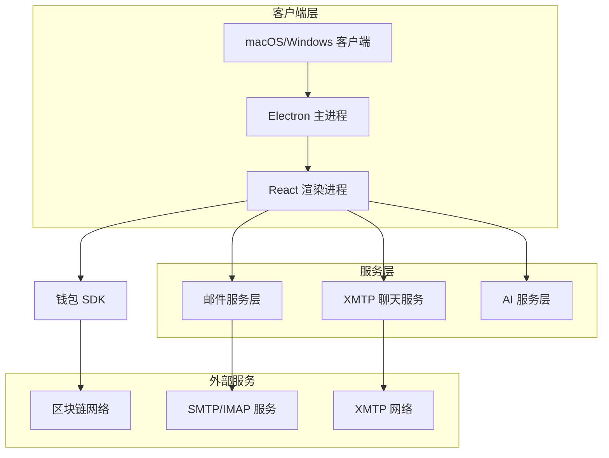
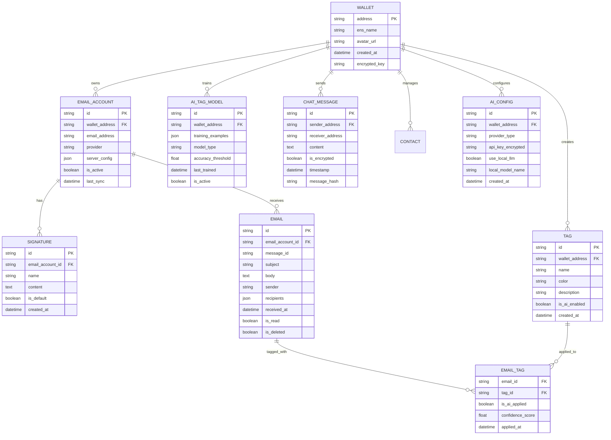

# Aura — 技术架构文档

## 1. 架构概览

### 1.1 设计原则

| 原则 | 说明 |
|------|------|
| **Local-First** | 所有数据优先存储在本地 SQLite，网络仅用于同步和外部服务调用。断网不影响核心功能 |
| **Offline-Capable** | 邮件浏览、搜索、草稿撰写在离线状态下完全可用，网络恢复后自动同步 |
| **Privacy-by-Design** | 零知识架构，敏感数据在客户端加密后存储，服务端不接触明文。支持本地 LLM 避免数据外传 |
| **插件化 AI** | AI 服务层抽象为 Provider 接口，支持 OpenAI / Claude / Ollama 等多种后端热切换 |

### 1.2 系统架构图



### 1.3 架构分层说明

| 层级 | 职责 | 技术实现 |
|------|------|----------|
| **渲染进程** | UI 展示、用户交互、状态管理 | React 18 + Zustand + TanStack Query |
| **预加载脚本** | 安全桥接渲染进程与主进程，暴露白名单 IPC 接口 | Electron contextBridge |
| **主进程** | 系统级操作、文件 I/O、数据库读写、网络请求 | Node.js + better-sqlite3 + Nodemailer |
| **服务层** | 业务逻辑封装：邮件收发、聊天、AI 调用 | TypeScript 模块，通过 IPC invoke/handle 暴露 |
| **外部服务** | SMTP/IMAP 服务器、XMTP 网络、以太坊区块链 | 第三方去中心化基础设施 |

---

## 2. 技术栈

### 2.1 技术选型与理由

| 类别 | 选择 | 备选方案 | 选择理由 |
|------|------|----------|----------|
| 桌面框架 | **Electron** (electron-vite) | Tauri | Electron 生态成熟，Node.js 原生支持 IMAP/SMTP 库（Nodemailer、Imapflow），Tauri 的 Rust 绑定增加邮件协议集成复杂度 |
| 前端框架 | **React 18** + TypeScript | Vue 3, Svelte | React 生态最大，Electron + React 社区方案丰富，TypeScript 类型安全保障大型项目可维护性 |
| UI 组件库 | **Shadcn/UI** (Radix UI) + TailwindCSS | Ant Design, MUI | Shadcn 组件可深度定制、无运行时依赖、与 Tailwind 配合实现设计系统；无需 eject 即可修改源码 |
| 动效 | **Framer Motion** | React Spring | API 声明式且直观，支持手势交互和布局动画，与 React 集成最佳 |
| 状态管理 | **Zustand** | Redux Toolkit, Jotai | 零样板代码，bundle 体积仅 1KB，支持中间件（devtools、persist），适合 Electron 场景的简洁 API |
| 异步数据 | **TanStack Query** | SWR | 内置缓存失效、轮询、乐观更新、离线支持，与 Local-First 架构天然契合 |
| 钱包集成 | **Wagmi v2** + Viem v2 + RainbowKit | ethers.js + web3modal | Wagmi/Viem 基于 TypeScript 原生设计，类型推导完整；RainbowKit 提供开箱即用的钱包连接 UI |
| 邮件发送 | **Nodemailer** | emailjs | Nodemailer 是 Node.js 邮件发送事实标准，支持 SMTP/OAuth2/DKIM，社区活跃 |
| 邮件接收 | **Imapflow** | node-imap | Imapflow 基于现代 async/await API，内置连接池和自动重连，node-imap 已停止维护 |
| 聊天协议 | **@xmtp/xmtp-js** | Matrix, Waku | XMTP 专为钱包对钱包通信设计，与 ENS 原生集成，无需额外身份映射 |
| 本地数据库 | **better-sqlite3** | sql.js, Dexie | better-sqlite3 是同步 API 的原生 SQLite 绑定，读写性能远优于 WASM 方案，适合 Electron 主进程 |
| 加密 | **node:crypto** + keytar | crypto-js | Node.js 内置 crypto 模块性能最佳，keytar 提供系统级 Keychain/Credential Store 安全存储 |
| Markdown 编辑器 | **Milkdown** | @uiw/react-md-editor | Milkdown 插件化架构，支持自定义节点（如 AI 建议高亮），基于 ProseMirror 扩展性强 |
| AI SDK | **Vercel AI SDK** | 直接调用各厂商 API | 统一多 Provider 接口（OpenAI/Claude/Ollama），内置流式响应处理，简化 AI 集成层 |

### 2.2 核心依赖版本

| 依赖 | 版本 | 说明 |
|------|------|------|
| electron | ^30.x | 桌面运行时 |
| electron-vite | ^2.x | 构建工具 |
| react | ^18.3 | UI 框架 |
| typescript | ^5.5 | 类型系统 |
| tailwindcss | ^3.4 | 样式工具 |
| zustand | ^4.5 | 状态管理 |
| @tanstack/react-query | ^5.x | 异步数据管理 |
| wagmi | ^2.x | 钱包集成 |
| viem | ^2.x | 以太坊交互 |
| @rainbow-me/rainbowkit | ^2.x | 钱包 UI |
| nodemailer | ^6.x | SMTP 邮件发送 |
| imapflow | ^1.x | IMAP 邮件接收 |
| @xmtp/xmtp-js | ^12.x | 去中心化消息 |
| better-sqlite3 | ^11.x | SQLite 数据库 |
| @milkdown/core | ^7.x | Markdown 编辑器 |
| framer-motion | ^11.x | 动画库 |
| ai (Vercel AI SDK) | ^3.x | AI 集成 |

---

## 3. 项目结构

### 3.1 目录布局

```
aura/
├── electron.vite.config.ts          # electron-vite 构建配置
├── package.json
├── tsconfig.json
│
├── src/
│   ├── main/                        # Electron 主进程
│   │   ├── index.ts                 # 主进程入口，窗口创建与生命周期
│   │   ├── ipc/                     # IPC Handler 注册
│   │   │   ├── auth.handler.ts      # 钱包认证 IPC
│   │   │   ├── email.handler.ts     # 邮件操作 IPC
│   │   │   ├── signature.handler.ts # 签名管理 IPC
│   │   │   ├── ai.handler.ts        # AI 服务 IPC
│   │   │   ├── tag.handler.ts       # 智能标签 IPC
│   │   │   └── chat.handler.ts      # 聊天 IPC
│   │   ├── services/                # 主进程业务逻辑
│   │   │   ├── email.service.ts     # Nodemailer + Imapflow 封装
│   │   │   ├── connection.manager.ts# 连接池与重连管理
│   │   │   ├── ai.service.ts        # AI Provider 统一接口
│   │   │   ├── crypto.service.ts    # 加密 / 解密服务
│   │   │   ├── tag.service.ts       # 智能标签分类逻辑
│   │   │   └── chat.service.ts      # XMTP 聊天封装
│   │   └── database/                # 数据库层
│   │       ├── db.ts                # SQLite 连接初始化
│   │       ├── migrations/          # 数据库迁移脚本
│   │       │   ├── 001_initial.sql
│   │       │   └── ...
│   │       └── repositories/        # 数据访问对象
│   │           ├── wallet.repo.ts
│   │           ├── email.repo.ts
│   │           ├── signature.repo.ts
│   │           ├── tag.repo.ts
│   │           └── chat.repo.ts
│   │
│   ├── preload/                     # 预加载脚本
│   │   └── index.ts                 # contextBridge 暴露安全 API
│   │
│   ├── renderer/                    # React 渲染进程
│   │   ├── index.html
│   │   ├── main.tsx                 # React 入口
│   │   ├── App.tsx                  # 根组件 + 路由
│   │   ├── routes/                  # 页面路由
│   │   │   ├── Login.tsx
│   │   │   ├── Inbox.tsx
│   │   │   ├── Compose.tsx
│   │   │   ├── Settings.tsx
│   │   │   ├── Chat.tsx
│   │   │   └── Tags.tsx
│   │   ├── components/              # 可复用组件
│   │   │   ├── ui/                  # Shadcn/UI 基础组件
│   │   │   ├── email/               # 邮件相关组件
│   │   │   ├── editor/              # Markdown 编辑器组件
│   │   │   ├── ai/                  # AI 助手面板组件
│   │   │   ├── wallet/              # 钱包连接组件
│   │   │   └── chat/                # 聊天界面组件
│   │   ├── stores/                  # Zustand 状态管理
│   │   │   ├── auth.store.ts
│   │   │   ├── email.store.ts
│   │   │   ├── editor.store.ts
│   │   │   └── tag.store.ts
│   │   ├── hooks/                   # 自定义 React Hooks
│   │   │   ├── useEmails.ts
│   │   │   ├── useAI.ts
│   │   │   └── useWallet.ts
│   │   ├── lib/                     # 工具函数
│   │   │   ├── ipc.ts               # IPC 调用封装
│   │   │   └── utils.ts
│   │   └── styles/                  # 全局样式
│   │       └── globals.css          # Tailwind 入口
│   │
│   └── shared/                      # 主进程 & 渲染进程共享
│       ├── types/                   # TypeScript 类型定义
│       │   ├── email.types.ts
│       │   ├── wallet.types.ts
│       │   ├── ai.types.ts
│       │   ├── tag.types.ts
│       │   └── ipc.types.ts         # IPC Channel 类型
│       └── constants/               # 常量定义
│           ├── channels.ts          # IPC Channel 名称
│           └── errors.ts            # 错误码定义
│
├── resources/                       # 静态资源（图标、托盘图标）
├── tests/                           # 测试目录
│   ├── unit/                        # 单元测试
│   ├── integration/                 # 集成测试
│   └── e2e/                         # E2E 测试
└── .github/
    └── workflows/                   # CI/CD
        └── release.yml
```

### 3.2 模块职责

| 模块 | 职责 | 关键文件 |
|------|------|----------|
| `main/ipc/` | 注册 IPC Handler，参数校验，调用 Service 层 | `*.handler.ts` |
| `main/services/` | 核心业务逻辑：邮件收发、AI 调用、加密解密 | `*.service.ts` |
| `main/database/` | SQLite 连接管理、迁移、数据访问 | `db.ts`, `repositories/` |
| `preload/` | 安全桥接，仅暴露白名单 IPC 方法到渲染进程 | `index.ts` |
| `renderer/routes/` | 页面级组件，每个路由对应一个页面 | `Login.tsx`, `Inbox.tsx` 等 |
| `renderer/stores/` | 全局状态管理，Zustand store 按领域划分 | `*.store.ts` |
| `shared/types/` | 跨进程共享的 TypeScript 类型定义 | `*.types.ts` |

---

## 4. 稳定性与可靠性

### 4.1 本地优先（Local-First）策略

- **数据本地化**：所有邮件、配置、聊天记录优先存储在本地 SQLite 数据库中
- **离线可用**：断网状态下，用户依然可以浏览历史邮件、搜索内容、撰写草稿。网络恢复后自动同步
- **乐观 UI（Optimistic UI）**：用户操作（如标记已读、发送消息）立即在界面反馈，后台异步处理，提升流畅度

### 4.2 Connection Manager（连接管理器）

- **自动重连机制**：
  - 指数退避策略：首次重连延迟 1 秒，后续每次翻倍（1s → 2s → 4s → 8s），最大延迟 30 秒
  - 智能检测：区分网络中断和服务商限流，对限流情况采用更长的退避时间
  - 连接健康检查：每 30 秒发送心跳包，超时 5 秒即触发重连
- **本地发件队列（Outbox Pattern）**：
  - 所有待发送邮件先存入本地 SQLite 队列，确保网络中断时不丢失
  - 后台异步处理器按优先级和邮箱账户分组发送，支持并发控制
  - 发送失败自动重试，最多重试 3 次，失败后标记为"草稿"状态
- **多邮箱连接池**：
  - 每个邮箱账户维护独立的 IMAP/SMTP 连接池，最大连接数可配置
  - 连接复用策略：相同邮箱账户的多个操作共享连接，减少握手开销
  - 连接状态监控：实时监控每个连接的健康状态，异常连接自动隔离
- **服务商适配**：
  - Gmail：OAuth 2.0 令牌自动刷新，处理"Too many simultaneous connections"错误
  - Outlook：处理 Modern Authentication 流程，支持 2FA 验证
  - 企业邮箱：智能识别 Exchange 服务器版本，适配不同的认证方式

### 4.3 错误处理与日志

- **用户友好的错误提示**：将底层网络错误转换为易懂的提示（如"网络连接不稳定，正在重试..."）
- **自动故障恢复**：遇到验证失败时，自动尝试刷新 Token 或重新握手，仅在无法自动修复时提示用户干预
- **本地日志**：记录关键操作日志到本地文件（加密），便于排查问题（需用户授权导出）

---

## 5. 路由定义

| 路由 | 页面 | 说明 |
|------|------|------|
| `/` | 登录页面 | 钱包连接和身份验证 |
| `/inbox` | 邮箱主页面 | 邮件列表、导航、智能标签 |
| `/compose` | 撰写邮件 | Markdown 编辑器、AI 助手、签名选择 |
| `/compose/:replyTo` | 回复邮件 | 预填原始邮件信息 |
| `/settings` | 设置页面 | 邮箱配置、签名管理 |
| `/settings/ai` | AI 设置 | API 密钥管理、本地 LLM 设置 |
| `/chat` | 聊天页面 | ENS 搜索、聊天列表 |
| `/chat/:address` | 聊天详情 | 与指定钱包地址的私聊 |
| `/tags` | 智能标签 | 标签管理、AI 学习设置 |
| `/tags/:id` | 标签详情 | 该标签下的所有邮件 |
| `/smart-folders` | 智能文件夹 | 基于标签的邮件聚合 |

---

## 6. API 定义

### 6.1 IPC 通信规范

Aura 使用 Electron 的 `ipcMain.handle` / `ipcRenderer.invoke` 模式实现主进程与渲染进程通信。所有 IPC 接口遵循以下规范：

```typescript
// 通用响应类型
interface IpcResponse<T> {
  success: boolean;
  data?: T;
  error?: {
    code: string;      // 错误码，如 "AUTH_WALLET_REJECTED"
    message: string;   // 用户可读的错误描述
    details?: unknown; // 调试信息（仅开发环境）
  };
}

// IPC Channel 命名规范: "模块:动作"
// 示例: "email:send", "ai:generate", "tag:create"
```

### 6.2 钱包认证 API

```typescript
// Channel: "auth:connect"
// 连接钱包并获取用户身份
interface AuthConnectRequest {
  walletType: 'metamask' | 'walletconnect' | 'coinbase';
}
interface AuthConnectResponse {
  address: string;        // 钱包地址 0x...
  ensName?: string;       // ENS 域名（如有）
  avatarUrl?: string;     // ENS 头像
  isNewUser: boolean;     // 是否首次使用
}

// Channel: "auth:sign"
// 请求用户签名（用于解密本地数据或验证身份）
interface AuthSignRequest {
  message: string;        // 待签名消息
  purpose: 'decrypt' | 'verify' | 'export';
}
interface AuthSignResponse {
  signature: string;      // 签名结果
}

// Channel: "auth:disconnect"
// 断开钱包连接
// Request: void
// Response: void
```

### 6.3 邮件操作 API

```typescript
// Channel: "email:sync"
// 触发邮箱同步
interface EmailSyncRequest {
  accountId?: string;     // 指定账户 ID，空则同步所有
  fullSync?: boolean;     // 是否全量同步（默认增量）
}
interface EmailSyncResponse {
  newCount: number;       // 新邮件数量
  updatedCount: number;   // 更新的邮件数量
  errors: Array<{         // 同步失败的账户
    accountId: string;
    errorCode: string;
  }>;
}

// Channel: "email:send"
// 发送邮件
interface EmailSendRequest {
  accountId: string;      // 发送账户 ID
  to: string[];           // 收件人
  cc?: string[];          // 抄送
  bcc?: string[];         // 密送
  subject: string;        // 主题
  body: string;           // Markdown 内容
  bodyHtml?: string;      // HTML 内容（由 Markdown 转换）
  signatureId?: string;   // 签名 ID
  replyTo?: string;       // 回复的邮件 ID
  attachments?: Array<{
    filename: string;
    path: string;
    contentType: string;
  }>;
}
interface EmailSendResponse {
  messageId: string;      // 发送成功的 Message-ID
  queueId?: string;       // 离线时返回队列 ID
  status: 'sent' | 'queued';
}

// Channel: "email:list"
// 获取邮件列表
interface EmailListRequest {
  accountId?: string;     // 筛选账户
  folder?: string;        // 筛选文件夹 (INBOX, Sent, Drafts...)
  tagId?: string;         // 按标签筛选
  query?: string;         // 搜索关键词
  page: number;           // 分页页码
  pageSize: number;       // 每页数量（默认 50）
}
interface EmailListResponse {
  emails: EmailSummary[];
  total: number;
  hasMore: boolean;
}
interface EmailSummary {
  id: string;
  accountId: string;
  messageId: string;
  subject: string;
  sender: string;
  senderName?: string;
  snippet: string;        // 内容预览（前 200 字符）
  receivedAt: string;     // ISO 8601
  isRead: boolean;
  isStarred: boolean;
  tags: Array<{ id: string; name: string; color: string }>;
}

// Channel: "email:get"
// 获取邮件详情
interface EmailGetRequest {
  emailId: string;
}
interface EmailGetResponse {
  id: string;
  accountId: string;
  messageId: string;
  subject: string;
  sender: string;
  senderName?: string;
  recipients: {
    to: string[];
    cc?: string[];
    bcc?: string[];
  };
  body: string;           // Markdown 原文
  bodyHtml: string;       // HTML 渲染
  receivedAt: string;
  isRead: boolean;
  attachments: Array<{
    filename: string;
    size: number;
    contentType: string;
  }>;
  tags: Array<{ id: string; name: string; color: string }>;
}

// Channel: "email:get_folders"
// 获取邮箱文件夹列表
interface EmailGetFoldersRequest {
  accountId: string;
}
interface EmailGetFoldersResponse {
  folders: Array<{
    name: string;         // 文件夹名称
    path: string;         // IMAP 路径
    unreadCount: number;
    totalCount: number;
  }>;
}

// Channel: "email:mark_read"
// 标记邮件已读/未读
interface EmailMarkReadRequest {
  emailIds: string[];
  isRead: boolean;
}

// Channel: "email:delete"
// 删除邮件（移至回收站）
interface EmailDeleteRequest {
  emailIds: string[];
  permanent?: boolean;    // 永久删除
}
```

### 6.4 签名管理 API

```typescript
// Channel: "signature:create"
interface SignatureCreateRequest {
  accountId: string;
  name: string;           // 签名名称
  content: string;        // 签名内容（HTML）
  isDefault?: boolean;
}
interface SignatureCreateResponse {
  id: string;
}

// Channel: "signature:list"
interface SignatureListRequest {
  accountId?: string;     // 按账户筛选
}
interface SignatureListResponse {
  signatures: Array<{
    id: string;
    accountId: string;
    name: string;
    content: string;
    isDefault: boolean;
    createdAt: string;
  }>;
}

// Channel: "signature:update"
interface SignatureUpdateRequest {
  id: string;
  name?: string;
  content?: string;
  isDefault?: boolean;
}

// Channel: "signature:delete"
interface SignatureDeleteRequest {
  id: string;
}
```

### 6.5 AI 服务 API

```typescript
// Channel: "ai:generate"
// AI 生成邮件内容
interface AiGenerateRequest {
  agentId?: string;       // 预设 Agent ID（如 "professional-reply"）
  templateId?: string;    // Prompt 模板 ID
  prompt: string;         // 用户自定义指令
  context?: {
    replyTo?: string;     // 被回复邮件的内容
    threadHistory?: string[];  // 邮件线程历史
  };
  provider?: string;      // 指定 AI Provider
  stream?: boolean;       // 是否流式返回
}
interface AiGenerateResponse {
  content: string;        // 生成的邮件内容（Markdown）
  tokensUsed: number;
  provider: string;
}

// Channel: "ai:refine"
// 优化现有文本
interface AiRefineRequest {
  content: string;        // 原始内容
  action: 'polish' | 'shorten' | 'expand' | 'formalize' | 'casualize' | 'translate';
  targetLanguage?: string;  // 翻译时的目标语言
  instructions?: string; // 额外指令
}
interface AiRefineResponse {
  content: string;
  diff?: string;          // 修改差异说明
  tokensUsed: number;
}

// Channel: "ai:classify_email"
// 智能分类邮件
interface AiClassifyRequest {
  emailId: string;
  availableTags: Array<{ id: string; name: string; description?: string }>;
}
interface AiClassifyResponse {
  suggestions: Array<{
    tagId: string;
    tagName: string;
    confidence: number;   // 0-1 置信度
    reason: string;       // 分类理由
  }>;
}

// Channel: "ai:providers"
// 获取可用的 AI Provider 列表
interface AiProvidersResponse {
  providers: Array<{
    id: string;
    name: string;         // "OpenAI", "Claude", "Ollama"
    isConfigured: boolean;
    isLocal: boolean;     // 是否本地运行
    models: string[];     // 可用模型列表
  }>;
}
```

### 6.6 智能标签 API

```typescript
// Channel: "tag:create"
interface TagCreateRequest {
  name: string;
  color: string;          // HEX 色值
  description?: string;
  isAiEnabled?: boolean;  // 是否启用 AI 自动分类
}
interface TagCreateResponse {
  id: string;
}

// Channel: "tag:list"
interface TagListResponse {
  tags: Array<{
    id: string;
    name: string;
    color: string;
    description?: string;
    isAiEnabled: boolean;
    emailCount: number;   // 关联邮件数
    createdAt: string;
  }>;
}

// Channel: "tag:apply"
// 手动应用标签到邮件
interface TagApplyRequest {
  emailIds: string[];
  tagId: string;
}

// Channel: "tag:auto_apply"
// AI 自动应用标签
interface TagAutoApplyRequest {
  emailIds: string[];     // 待分类的邮件
}
interface TagAutoApplyResponse {
  results: Array<{
    emailId: string;
    appliedTags: Array<{
      tagId: string;
      confidence: number;
    }>;
  }>;
}

// Channel: "tag:smart_folders"
// 获取智能文件夹
interface TagSmartFoldersResponse {
  folders: Array<{
    tagId: string;
    tagName: string;
    tagColor: string;
    unreadCount: number;
    totalCount: number;
  }>;
}
```

### 6.7 错误码表

| 错误码前缀 | 模块 | 示例 | 说明 |
|------------|------|------|------|
| `AUTH_` | 认证 | `AUTH_WALLET_REJECTED` | 用户拒绝钱包连接 |
| | | `AUTH_WALLET_NOT_FOUND` | 未检测到钱包扩展 |
| | | `AUTH_SIGN_FAILED` | 签名失败 |
| | | `AUTH_ENS_RESOLVE_FAILED` | ENS 解析失败 |
| `EMAIL_` | 邮件 | `EMAIL_IMAP_AUTH_FAILED` | IMAP 认证失败 |
| | | `EMAIL_SMTP_AUTH_FAILED` | SMTP 认证失败 |
| | | `EMAIL_SEND_FAILED` | 邮件发送失败 |
| | | `EMAIL_SYNC_TIMEOUT` | 同步超时 |
| | | `EMAIL_RATE_LIMITED` | 触发服务商限流 |
| | | `EMAIL_INVALID_RECIPIENT` | 收件人地址无效 |
| `AI_` | AI | `AI_PROVIDER_UNAVAILABLE` | AI 服务商不可用 |
| | | `AI_API_KEY_INVALID` | API Key 无效 |
| | | `AI_RATE_LIMITED` | AI 调用频率超限 |
| | | `AI_CONTEXT_TOO_LONG` | 上下文超出模型限制 |
| | | `AI_LOCAL_MODEL_NOT_FOUND` | 本地 LLM 模型未安装 |
| `TAG_` | 标签 | `TAG_DUPLICATE_NAME` | 标签名称重复 |
| | | `TAG_NOT_FOUND` | 标签不存在 |
| | | `TAG_CLASSIFY_FAILED` | AI 分类失败 |
| `NET_` | 网络 | `NET_OFFLINE` | 无网络连接 |
| | | `NET_TIMEOUT` | 请求超时 |
| | | `NET_DNS_FAILED` | DNS 解析失败 |
| `CHAT_` | 聊天 | `CHAT_XMTP_INIT_FAILED` | XMTP 客户端初始化失败 |
| | | `CHAT_PEER_NOT_FOUND` | 对方未注册 XMTP |
| | | `CHAT_ENCRYPT_FAILED` | 消息加密失败 |
| `DB_` | 数据库 | `DB_MIGRATION_FAILED` | 数据库迁移失败 |
| | | `DB_CORRUPT` | 数据库损坏 |
| | | `DB_WRITE_FAILED` | 写入失败 |

---

## 7. 数据模型

### 7.1 ER 图



### 7.2 SQLite DDL

```sql
-- ============================================================
-- Aura 数据库 Schema
-- 数据库引擎: SQLite (better-sqlite3)
-- 编码: UTF-8, WAL 模式
-- ============================================================

PRAGMA journal_mode = WAL;
PRAGMA foreign_keys = ON;

-- -----------------------------------------------------------
-- 1. 钱包用户表
-- -----------------------------------------------------------
CREATE TABLE wallet (
    address         TEXT PRIMARY KEY,                -- 钱包地址 (0x...)
    ens_name        TEXT,                            -- ENS 域名
    avatar_url      TEXT,                            -- ENS 头像 URL
    encrypted_key   TEXT NOT NULL,                   -- 加密后的派生密钥
    created_at      TEXT NOT NULL DEFAULT (datetime('now')),
    updated_at      TEXT NOT NULL DEFAULT (datetime('now'))
);

-- -----------------------------------------------------------
-- 2. 邮箱账户表
-- -----------------------------------------------------------
CREATE TABLE email_account (
    id              TEXT PRIMARY KEY,                -- UUID
    wallet_address  TEXT NOT NULL REFERENCES wallet(address) ON DELETE CASCADE,
    email_address   TEXT NOT NULL,                   -- 邮箱地址
    display_name    TEXT,                            -- 显示名称
    provider        TEXT NOT NULL,                   -- 服务商 (gmail, outlook, icloud, custom)
    imap_host       TEXT NOT NULL,
    imap_port       INTEGER NOT NULL DEFAULT 993,
    smtp_host       TEXT NOT NULL,
    smtp_port       INTEGER NOT NULL DEFAULT 465,
    auth_type       TEXT NOT NULL DEFAULT 'password', -- password | oauth2
    credentials     TEXT NOT NULL,                   -- 加密后的凭证 (密码或 OAuth Token)
    is_active       INTEGER NOT NULL DEFAULT 1,
    last_sync_at    TEXT,
    created_at      TEXT NOT NULL DEFAULT (datetime('now')),
    updated_at      TEXT NOT NULL DEFAULT (datetime('now'))
);

CREATE INDEX idx_email_account_wallet ON email_account(wallet_address);
CREATE UNIQUE INDEX idx_email_account_address ON email_account(wallet_address, email_address);

-- -----------------------------------------------------------
-- 3. 邮件表
-- -----------------------------------------------------------
CREATE TABLE email (
    id                TEXT PRIMARY KEY,              -- UUID
    email_account_id  TEXT NOT NULL REFERENCES email_account(id) ON DELETE CASCADE,
    message_id        TEXT NOT NULL,                 -- RFC 2822 Message-ID
    folder            TEXT NOT NULL DEFAULT 'INBOX', -- IMAP 文件夹
    subject           TEXT,
    sender            TEXT NOT NULL,                 -- 发件人地址
    sender_name       TEXT,                          -- 发件人显示名
    recipients_to     TEXT,                          -- JSON: 收件人列表
    recipients_cc     TEXT,                          -- JSON: 抄送列表
    recipients_bcc    TEXT,                          -- JSON: 密送列表
    body_text         TEXT,                          -- 纯文本内容
    body_html         TEXT,                          -- HTML 内容
    snippet           TEXT,                          -- 内容预览 (前 200 字符)
    received_at       TEXT NOT NULL,                 -- 接收时间 ISO 8601
    is_read           INTEGER NOT NULL DEFAULT 0,
    is_starred        INTEGER NOT NULL DEFAULT 0,
    is_deleted        INTEGER NOT NULL DEFAULT 0,
    has_attachments   INTEGER NOT NULL DEFAULT 0,
    raw_size          INTEGER,                       -- 原始邮件大小 (bytes)
    created_at        TEXT NOT NULL DEFAULT (datetime('now'))
);

CREATE INDEX idx_email_account ON email(email_account_id);
CREATE INDEX idx_email_folder ON email(email_account_id, folder);
CREATE INDEX idx_email_received ON email(received_at DESC);
CREATE INDEX idx_email_message_id ON email(message_id);
CREATE INDEX idx_email_sender ON email(sender);
CREATE INDEX idx_email_read ON email(email_account_id, is_read) WHERE is_read = 0;
CREATE INDEX idx_email_deleted ON email(is_deleted) WHERE is_deleted = 0;

-- 全文搜索索引
CREATE VIRTUAL TABLE email_fts USING fts5(
    subject, sender, sender_name, body_text, snippet,
    content='email',
    content_rowid='rowid'
);

-- FTS 触发器：同步插入
CREATE TRIGGER email_fts_insert AFTER INSERT ON email BEGIN
    INSERT INTO email_fts(rowid, subject, sender, sender_name, body_text, snippet)
    VALUES (new.rowid, new.subject, new.sender, new.sender_name, new.body_text, new.snippet);
END;

-- FTS 触发器：同步删除
CREATE TRIGGER email_fts_delete AFTER DELETE ON email BEGIN
    INSERT INTO email_fts(email_fts, rowid, subject, sender, sender_name, body_text, snippet)
    VALUES ('delete', old.rowid, old.subject, old.sender, old.sender_name, old.body_text, old.snippet);
END;

-- FTS 触发器：同步更新
CREATE TRIGGER email_fts_update AFTER UPDATE ON email BEGIN
    INSERT INTO email_fts(email_fts, rowid, subject, sender, sender_name, body_text, snippet)
    VALUES ('delete', old.rowid, old.subject, old.sender, old.sender_name, old.body_text, old.snippet);
    INSERT INTO email_fts(rowid, subject, sender, sender_name, body_text, snippet)
    VALUES (new.rowid, new.subject, new.sender, new.sender_name, new.body_text, new.snippet);
END;

-- -----------------------------------------------------------
-- 4. 邮件附件表
-- -----------------------------------------------------------
CREATE TABLE email_attachment (
    id              TEXT PRIMARY KEY,                -- UUID
    email_id        TEXT NOT NULL REFERENCES email(id) ON DELETE CASCADE,
    filename        TEXT NOT NULL,
    content_type    TEXT NOT NULL,
    size            INTEGER NOT NULL,                -- 文件大小 (bytes)
    local_path      TEXT,                            -- 本地缓存路径
    is_downloaded   INTEGER NOT NULL DEFAULT 0,
    created_at      TEXT NOT NULL DEFAULT (datetime('now'))
);

CREATE INDEX idx_attachment_email ON email_attachment(email_id);

-- -----------------------------------------------------------
-- 5. 签名表
-- -----------------------------------------------------------
CREATE TABLE signature (
    id                TEXT PRIMARY KEY,              -- UUID
    email_account_id  TEXT NOT NULL REFERENCES email_account(id) ON DELETE CASCADE,
    name              TEXT NOT NULL,                 -- 签名名称
    content_html      TEXT NOT NULL,                 -- HTML 签名内容
    content_text      TEXT,                          -- 纯文本版本
    is_default        INTEGER NOT NULL DEFAULT 0,
    sort_order        INTEGER NOT NULL DEFAULT 0,
    created_at        TEXT NOT NULL DEFAULT (datetime('now')),
    updated_at        TEXT NOT NULL DEFAULT (datetime('now'))
);

CREATE INDEX idx_signature_account ON signature(email_account_id);

-- -----------------------------------------------------------
-- 6. 标签表
-- -----------------------------------------------------------
CREATE TABLE tag (
    id              TEXT PRIMARY KEY,                -- UUID
    wallet_address  TEXT NOT NULL REFERENCES wallet(address) ON DELETE CASCADE,
    name            TEXT NOT NULL,
    color           TEXT NOT NULL DEFAULT '#8B5CF6', -- HEX 色值
    description     TEXT,
    is_ai_enabled   INTEGER NOT NULL DEFAULT 0,      -- 是否启用 AI 自动分类
    sort_order      INTEGER NOT NULL DEFAULT 0,
    created_at      TEXT NOT NULL DEFAULT (datetime('now')),
    updated_at      TEXT NOT NULL DEFAULT (datetime('now'))
);

CREATE INDEX idx_tag_wallet ON tag(wallet_address);
CREATE UNIQUE INDEX idx_tag_name ON tag(wallet_address, name);

-- -----------------------------------------------------------
-- 7. 邮件-标签关联表
-- -----------------------------------------------------------
CREATE TABLE email_tag (
    email_id          TEXT NOT NULL REFERENCES email(id) ON DELETE CASCADE,
    tag_id            TEXT NOT NULL REFERENCES tag(id) ON DELETE CASCADE,
    is_ai_applied     INTEGER NOT NULL DEFAULT 0,    -- 是否 AI 自动应用
    confidence_score  REAL,                          -- AI 置信度 (0-1)
    applied_at        TEXT NOT NULL DEFAULT (datetime('now')),
    PRIMARY KEY (email_id, tag_id)
);

CREATE INDEX idx_email_tag_tag ON email_tag(tag_id);

-- -----------------------------------------------------------
-- 8. AI 标签模型表
-- -----------------------------------------------------------
CREATE TABLE ai_tag_model (
    id                  TEXT PRIMARY KEY,            -- UUID
    wallet_address      TEXT NOT NULL REFERENCES wallet(address) ON DELETE CASCADE,
    model_type          TEXT NOT NULL DEFAULT 'few-shot', -- few-shot | fine-tuned
    training_examples   TEXT,                        -- JSON: 训练样本
    accuracy_threshold  REAL NOT NULL DEFAULT 0.7,   -- 最低置信度阈值
    total_predictions   INTEGER NOT NULL DEFAULT 0,
    correct_predictions INTEGER NOT NULL DEFAULT 0,
    last_trained_at     TEXT,
    is_active           INTEGER NOT NULL DEFAULT 1,
    created_at          TEXT NOT NULL DEFAULT (datetime('now')),
    updated_at          TEXT NOT NULL DEFAULT (datetime('now'))
);

CREATE INDEX idx_ai_model_wallet ON ai_tag_model(wallet_address);

-- -----------------------------------------------------------
-- 9. 聊天消息表
-- -----------------------------------------------------------
CREATE TABLE chat_message (
    id                TEXT PRIMARY KEY,              -- UUID
    conversation_id   TEXT NOT NULL,                 -- XMTP 会话 ID
    sender_address    TEXT NOT NULL,                 -- 发送方钱包地址
    receiver_address  TEXT NOT NULL,                 -- 接收方钱包地址
    content           TEXT NOT NULL,                 -- 消息内容（已解密）
    content_type      TEXT NOT NULL DEFAULT 'text',  -- text | image | file
    is_encrypted      INTEGER NOT NULL DEFAULT 1,
    message_hash      TEXT,                          -- 消息哈希（用于去重）
    status            TEXT NOT NULL DEFAULT 'sent',  -- sent | delivered | read
    timestamp         TEXT NOT NULL,                 -- ISO 8601
    created_at        TEXT NOT NULL DEFAULT (datetime('now'))
);

CREATE INDEX idx_chat_conversation ON chat_message(conversation_id);
CREATE INDEX idx_chat_sender ON chat_message(sender_address);
CREATE INDEX idx_chat_receiver ON chat_message(receiver_address);
CREATE INDEX idx_chat_timestamp ON chat_message(conversation_id, timestamp DESC);
CREATE UNIQUE INDEX idx_chat_hash ON chat_message(message_hash) WHERE message_hash IS NOT NULL;

-- -----------------------------------------------------------
-- 10. 联系人表
-- -----------------------------------------------------------
CREATE TABLE contact (
    id              TEXT PRIMARY KEY,                -- UUID
    wallet_address  TEXT NOT NULL REFERENCES wallet(address) ON DELETE CASCADE,
    contact_address TEXT,                            -- 对方钱包地址（可为空）
    email_address   TEXT,                            -- 对方邮箱地址（可为空）
    display_name    TEXT,
    ens_name        TEXT,
    avatar_url      TEXT,
    notes           TEXT,
    is_favorite     INTEGER NOT NULL DEFAULT 0,
    last_contact_at TEXT,
    created_at      TEXT NOT NULL DEFAULT (datetime('now')),
    updated_at      TEXT NOT NULL DEFAULT (datetime('now'))
);

CREATE INDEX idx_contact_wallet ON contact(wallet_address);
CREATE INDEX idx_contact_email ON contact(email_address);

-- -----------------------------------------------------------
-- 11. AI 配置表
-- -----------------------------------------------------------
CREATE TABLE ai_config (
    id                TEXT PRIMARY KEY,              -- UUID
    wallet_address    TEXT NOT NULL REFERENCES wallet(address) ON DELETE CASCADE,
    provider_type     TEXT NOT NULL,                 -- openai | anthropic | ollama
    api_key_encrypted TEXT,                          -- 加密后的 API Key
    base_url          TEXT,                          -- 自定义 API 端点
    default_model     TEXT,                          -- 默认模型名称
    use_local_llm     INTEGER NOT NULL DEFAULT 0,
    local_model_name  TEXT,                          -- Ollama 模型名
    max_tokens        INTEGER NOT NULL DEFAULT 4096,
    temperature       REAL NOT NULL DEFAULT 0.7,
    is_active         INTEGER NOT NULL DEFAULT 1,
    created_at        TEXT NOT NULL DEFAULT (datetime('now')),
    updated_at        TEXT NOT NULL DEFAULT (datetime('now'))
);

CREATE INDEX idx_ai_config_wallet ON ai_config(wallet_address);

-- -----------------------------------------------------------
-- 12. 发件队列表（Outbox Pattern）
-- -----------------------------------------------------------
CREATE TABLE outbox (
    id              TEXT PRIMARY KEY,                -- UUID
    email_account_id TEXT NOT NULL REFERENCES email_account(id) ON DELETE CASCADE,
    payload         TEXT NOT NULL,                   -- JSON: 完整的邮件发送参数
    status          TEXT NOT NULL DEFAULT 'pending', -- pending | sending | sent | failed
    retry_count     INTEGER NOT NULL DEFAULT 0,
    max_retries     INTEGER NOT NULL DEFAULT 3,
    error_message   TEXT,
    scheduled_at    TEXT,                            -- 定时发送时间
    created_at      TEXT NOT NULL DEFAULT (datetime('now')),
    updated_at      TEXT NOT NULL DEFAULT (datetime('now'))
);

CREATE INDEX idx_outbox_status ON outbox(status) WHERE status IN ('pending', 'sending');
CREATE INDEX idx_outbox_account ON outbox(email_account_id);
```

### 7.3 索引策略

| 表 | 索引 | 用途 |
|------|------|------|
| `email` | `idx_email_received` | 按时间倒序查询收件箱 |
| `email` | `idx_email_read` (部分索引) | 快速查询未读邮件 |
| `email` | `idx_email_folder` | 按文件夹筛选邮件 |
| `email` | `email_fts` (FTS5) | 全文搜索邮件主题和内容 |
| `email_tag` | `idx_email_tag_tag` | 按标签查询邮件 |
| `chat_message` | `idx_chat_timestamp` | 按会话和时间排序消息 |
| `chat_message` | `idx_chat_hash` (唯一部分索引) | XMTP 消息去重 |
| `outbox` | `idx_outbox_status` (部分索引) | 查询待发送邮件 |

### 7.4 数据迁移方案

- 使用版本化 SQL 脚本管理迁移（`migrations/001_initial.sql`, `002_add_outbox.sql`, ...）
- `db.ts` 启动时检查当前 Schema 版本，按顺序执行未应用的迁移
- 所有迁移在事务中执行，失败自动回滚
- 破坏性变更（删列、改类型）通过"创建新表 → 迁移数据 → 删除旧表"的方式执行

```typescript
// migrations 管理示意
interface Migration {
  version: number;
  name: string;
  up: string;   // SQL 升级脚本
  down: string;  // SQL 回滚脚本
}
```

---

## 8. 安全架构

### 8.1 加密策略

| 数据类型 | 加密方式 | 存储位置 |
|---------|----------|----------|
| 钱包派生密钥 | 用户密码 + AES-256-GCM | 系统 Keychain (macOS) / Credential Store (Windows) |
| 邮箱凭证 | 钱包签名派生密钥 + AES-256-GCM | SQLite `email_account.credentials` |
| AI API Key | 系统级加密（keytar） | SQLite `ai_config.api_key_encrypted` |
| 聊天消息 | XMTP 协议端到端加密 | 本地 SQLite（已解密副本） |
| 邮件内容 | 静态加密（可选，AES-256-GCM） | SQLite `email.body_text` / `body_html` |
| 本地日志 | AES-256-CBC | 日志文件（用户授权后可导出） |

### 8.2 隐私保护

- **零知识架构**：服务端不存储用户明文数据，所有数据处理在客户端完成
- **本地优先**：所有数据优先本地处理，减少网络传输
- **去中心化身份**：用户完全掌控身份，无需信任第三方
- **开源验证**：核心加密代码开源，接受社区审计
- **AI 隐私**：支持本地 LLM（Ollama），敏感数据无需上传云端
- **上下文安全**：AI 提示词经过脱敏处理，避免泄露敏感信息

### 8.3 威胁模型

| 威胁 | 攻击面 | 风险等级 | 缓解措施 |
|------|--------|---------|----------|
| 本地数据库被读取 | 物理接触设备或恶意软件 | 高 | SQLite 数据库加密（SQLCipher 可选），敏感字段独立加密，系统 Keychain 存储密钥 |
| IMAP/SMTP 凭证泄露 | 内存转储、日志泄露 | 高 | 凭证始终加密存储，内存中仅短暂解密使用后清零，禁止日志记录凭证 |
| 中间人攻击 | 公共 Wi-Fi 环境 | 中 | 强制 TLS/SSL 连接，证书固定（Certificate Pinning）可选 |
| AI API Key 泄露 | 渲染进程 XSS | 中 | API Key 仅在主进程持有，渲染进程通过 IPC 调用，contextIsolation 启用 |
| 恶意 Electron 更新 | 自动更新被劫持 | 中 | 代码签名验证（Apple Notarization + Windows EV 证书），更新包签名校验 |
| XSS 攻击 | 邮件 HTML 渲染 | 中 | 邮件 HTML 经 DOMPurify 消毒，iframe 沙箱隔离，禁用内联脚本 |
| 钱包签名钓鱼 | 恶意签名请求 | 低 | 签名前展示可读的签名内容说明，限制签名用途（仅 decrypt/verify/export） |

---

## 9. 测试策略

### 9.1 单元测试

- **框架**：Vitest（与 Vite 生态一致，配置零成本）
- **覆盖率目标**：核心业务逻辑 > 80%，工具函数 > 90%
- **重点模块**：
  - `services/email.service.ts` — 邮件发送/接收逻辑
  - `services/crypto.service.ts` — 加密/解密正确性
  - `services/tag.service.ts` — 标签分类逻辑
  - `database/repositories/` — 数据库 CRUD 操作
  - `shared/` — 类型验证、工具函数

### 9.2 集成测试

- **框架**：Vitest + 内存 SQLite
- **测试范围**：
  - IPC Handler → Service → Repository 完整链路
  - 数据库迁移脚本的正向和回滚执行
  - Connection Manager 重连逻辑（模拟网络中断）
  - AI Provider 切换和降级
- **Mock 策略**：外部服务（SMTP/IMAP/XMTP/AI API）使用 Mock，本地 SQLite 使用内存数据库

### 9.3 E2E 测试

- **框架**：Playwright for Electron（`electron` fixture）
- **测试场景**：
  - 首次使用流程：钱包连接 → 添加邮箱 → 发送第一封邮件
  - 离线模式：断网后浏览邮件、撰写草稿、恢复后自动同步
  - AI 辅助：选择 Agent → 生成内容 → 对话优化 → 发送
- **运行方式**：CI 中使用 headless Electron，本地开发可 headed 调试

---

## 10. 构建与部署

### 10.1 开发环境搭建

**前置条件**

| 工具 | 版本要求 | 说明 |
|------|----------|------|
| Node.js | >= 20 LTS | 推荐使用 fnm 或 nvm 管理版本 |
| pnpm | >= 9.x | 包管理器（lockfile 一致性） |
| Python | >= 3.10 | better-sqlite3 原生编译依赖 |
| Xcode CLT | latest | macOS 原生模块编译 |
| VS Build Tools | 2022 | Windows 原生模块编译 |

**安装与启动**

```bash
# 克隆项目
git clone https://github.com/AuraEmail/aura.git
cd aura

# 安装依赖
pnpm install

# 启动开发服务器（自动打开 Electron 窗口）
pnpm dev

# 仅构建渲染进程（热更新）
pnpm dev:renderer

# 运行测试
pnpm test           # 单元测试
pnpm test:e2e       # E2E 测试
pnpm test:coverage  # 覆盖率报告

# 代码检查
pnpm lint           # ESLint + Prettier
pnpm typecheck      # TypeScript 类型检查
```

**环境变量**

```bash
# .env.local（不提交到 Git）
VITE_DEFAULT_AI_PROVIDER=openai     # 默认 AI 服务商
VITE_XMTP_ENV=production            # XMTP 网络环境 (dev | production)
VITE_INFURA_PROJECT_ID=xxx          # Infura/Alchemy RPC (ENS 解析)
```

### 10.2 CI/CD

```yaml
# .github/workflows/release.yml (简化示意)
name: Build & Release

on:
  push:
    tags: ['v*']

jobs:
  lint-and-test:
    runs-on: ubuntu-latest
    steps:
      - uses: actions/checkout@v4
      - uses: pnpm/action-setup@v4
      - uses: actions/setup-node@v4
        with: { node-version: 20 }
      - run: pnpm install --frozen-lockfile
      - run: pnpm lint
      - run: pnpm typecheck
      - run: pnpm test --coverage

  build-macos:
    needs: lint-and-test
    runs-on: macos-latest
    steps:
      - uses: actions/checkout@v4
      - run: pnpm install --frozen-lockfile
      - run: pnpm build:mac
      # electron-builder 产出 .dmg + .zip (x64 + arm64)
      - uses: softprops/action-gh-release@v2
        with:
          files: dist/*.dmg

  build-windows:
    needs: lint-and-test
    runs-on: windows-latest
    steps:
      - uses: actions/checkout@v4
      - run: pnpm install --frozen-lockfile
      - run: pnpm build:win
      # electron-builder 产出 .exe + .msi
      - uses: softprops/action-gh-release@v2
        with:
          files: dist/*.exe
```

**CI 流水线**：`lint` → `typecheck` → `test` → `build` → `sign` → `publish to GitHub Releases`

### 10.3 客户端分发

- **跨平台构建**：Electron-builder 同时生成 `.dmg`（macOS）和 `.exe`（Windows）安装包
- **构建配置**：
  - macOS：`.dmg` + `.zip`，支持 Apple Silicon（arm64）和 Intel（x64）双架构
  - Windows：`.exe` 安装程序 + `.msi` 包，支持 x64 和 ARM64
- **自动更新**：GitHub Releases + Electron autoUpdater，支持增量更新
- **代码签名**：
  - macOS：Apple Developer 证书签名 + Notarization 认证
  - Windows：EV 代码签名证书，消除 SmartScreen 警告
- **沙箱模式**：启用 Electron 沙箱，限制进程权限

### 10.4 去中心化服务

- **XMTP 网络**：无需自建服务器，使用去中心化消息网络
- **ENS 解析**：直接调用以太坊主网合约（通过 Infura/Alchemy RPC），无需中介
- **IPFS 存储**：可选的大附件去中心化存储方案

---

## 11. 性能指标

### 11.1 性能基准

| 指标 | 目标值 | 测量方式 |
|------|--------|----------|
| 冷启动 | < 3s | 从进程创建到渲染进程 `DOMContentLoaded` |
| 邮件列表渲染 | < 200ms | 1000 条邮件首屏渲染（虚拟滚动） |
| 邮件搜索 | < 100ms | FTS5 全文搜索 10 万条邮件 |
| SQLite 写入 | < 5ms / 条 | 单条邮件插入含索引更新 |
| AI 首 Token | < 2s | 云端 API 首个 Token 返回 |
| 内存占用 | < 300MB | 正常使用（3 邮箱账户、1000 封邮件缓存） |
| 安装包体积 | < 150MB | macOS .dmg 压缩后 |

### 11.2 监控方案

- **性能埋点**：关键路径（启动、同步、搜索、AI 调用）记录耗时到本地 SQLite
- **崩溃收集**：Electron `crashReporter` + 匿名上报（Opt-in），不含用户数据
- **资源监控**：主进程定期采样 CPU / 内存使用率，超阈值写入告警日志
- **用户行为分析**：匿名功能使用统计（Opt-in），用于指导产品迭代

> 所有监控数据默认仅存储在本地，用户可选择匿名上报以帮助改进产品。

---

## 附录：术语表

| 术语 | 说明 |
|------|------|
| **IPC** | Inter-Process Communication，Electron 主进程与渲染进程间的通信机制 |
| **WAL** | Write-Ahead Logging，SQLite 日志模式，提升并发读写性能 |
| **FTS5** | Full-Text Search 5，SQLite 内置全文搜索引擎 |
| **Outbox Pattern** | 发件箱模式，消息先写入本地队列再异步发送，保证不丢失 |
| **contextBridge** | Electron 安全 API，在渲染进程中暴露受限的主进程功能 |
| **Keychain** | macOS 系统级安全凭证存储 |
| **Credential Store** | Windows 系统级安全凭证存储 |
| **DOMPurify** | HTML 消毒库，防止 XSS 攻击 |
